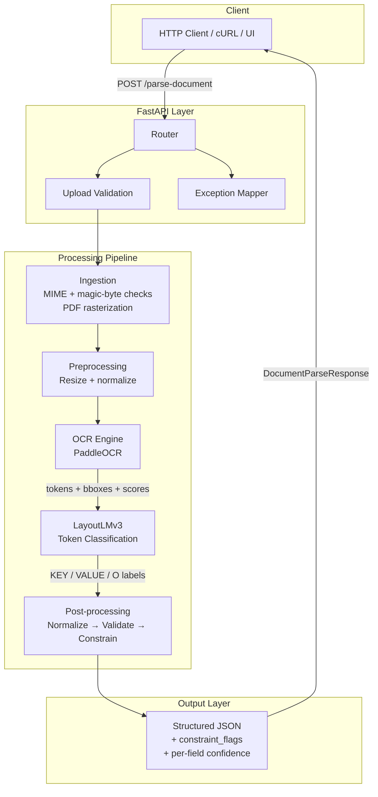

<div align="center">
  <h1>Document Intelligence Engine</h1>
  <p><strong>Layout-Aware Multimodal Document Parsing — PDF/Image → Deterministic Structured JSON</strong></p>

  [](https://www.python.org/downloads/)
  [](https://pytorch.org/)
  [](https://huggingface.co/microsoft/layoutlmv3-base)
  [](https://fastapi.tiangolo.com)
  [](https://www.docker.com/)
  [](https://opensource.org/licenses/MIT)
</div>

---

## Overview

**Document Intelligence Engine** is a production-grade system that converts unstructured documents — PDFs, invoices, receipts, scanned forms — into validated structured JSON.

It addresses a fundamental gap in document automation: **OCR-only systems** have no spatial awareness and collapse on complex layouts; **LLM-based extractors** are non-deterministic and cannot be trusted for production output. This system combines **LayoutLMv3** (a multimodal transformer that jointly encodes pixel layout, text tokens, and bounding box positions) with a strict **deterministic post-processing layer** that validates, normalizes, and enforces cross-field constraints on every extraction — guaranteed same output for same input.

---

## Key Features

- **Layout-Aware Extraction**: LayoutLMv3 encodes bounding box coordinates alongside text, allowing the model to distinguish field labels from their values even on multi-column, tabular, or non-standard form layouts.
- **Deterministic Post-Processing**: Every output passes through normalization (dates → ISO 8601, currencies → `float`), regex field validation, and a constraint engine (e.g., `sum(line_items) ≈ total_amount`). No variance between runs.
- **Strict Security by Design**: File uploads are validated at extension, MIME type, and magic-byte level. Oversized files, malformed PDFs, and path traversal attempts are rejected before processing.
- **Typed Data Contracts**: `ValidatedFile`, `OCRResult`, `ModelPrediction`, `ConstraintResult` — every stage in the pipeline has an explicit typed interface.
- **Ablation Framework**: Three canonical experiments (no layout embeddings, no post-processing, degraded OCR quality) are implemented and runnable out of the box.
- **Multi-LLM Backbone**: Swap between `microsoft/layoutlmv3-base` and any fine-tuned checkpoint without changing the pipeline.
- **Production API**: FastAPI with structured error mapping, per-request IDs, batch parsing endpoint, and background file cleanup.

---

## Architecture



### Data Flow

```
UploadFile
  → validate_upload()             # extension, MIME, magic bytes, size
  → load_pages()                  # rasterize PDF or open image
  → ImageNormalizationService     # deterministic page prep
  → OCRService.extract()          # tokens + bboxes + confidence
  → LayoutLMv3InferenceService    # per-token field classification
  → normalize_document()          # date/currency/OCR artifact cleanup
  → validate_document()           # regex + semantic field checks
  → apply_constraints()           # cross-field consistency enforcement
  → DocumentParseResponse         # typed, validated JSON output
```

---

## Quick Start

### 1. Clone & Install

```bash
git clone https://github.com/purvanshh/document-intelligence-engine.git
cd document-intelligence-engine

python3.11 -m venv .venv && source .venv/bin/activate
pip install --upgrade pip
pip install -r requirements.txt
```

### 2. Configure Environment

```bash
cp .env.example .env
# Edit .env for model path, OCR backend, API settings
```

All settings support environment variable overrides with the `DIE_` prefix:

```bash
DIE_API__PORT=8080
DIE_OCR__MIN_CONFIDENCE=0.6
DIE_POSTPROCESSING__CONSTRAINTS__AMOUNT_TOLERANCE=0.02
```

### 3. Run the API

```bash
uvicorn api.main:app --host 0.0.0.0 --port 8000 --reload
```

Open **[http://localhost:8000/docs](http://localhost:8000/docs)** for the interactive Swagger UI.

### 4. Parse a Document

```bash
curl -X POST http://localhost:8000/parse-document \
     -F "file=@invoice.pdf"
```

---

## Docker Deployment

```bash
# Build and start the API
docker compose -f docker/docker-compose.yml up --build

# Include Redis for async processing
docker compose -f docker/docker-compose.yml --profile async up
```

The API will be available at **`http://localhost:8000`**.

---

## API Reference

Once the backend is running, Swagger UI is available at `http://localhost:8000/docs`.

| Method | Endpoint | Description |
|---|---|---|
| `GET` | `/health` | Liveness + model readiness check |
| `POST` | `/parse-document` | Parse a single PDF or image |
| `POST` | `/parse-batch` | Parse multiple files in one request |

**POST /parse-document**

Input: `multipart/form-data` with a single `file` field (PDF, PNG, JPEG, TIFF).

```bash
curl -X POST http://localhost:8000/parse-document \
     -F "file=@invoice.pdf" \
     -F "debug=false"
```

**Response:**

```json
{
  "document": {
    "invoice_number": { "value": "INV-1023",    "confidence": 0.924, "valid": true },
    "date":           { "value": "2025-01-12",   "confidence": 0.911, "valid": true },
    "vendor":         { "value": "ABC Pvt Ltd",  "confidence": 0.887, "valid": true },
    "total_amount":   { "value": 1200.50,        "confidence": 0.883, "valid": true },
    "line_items": {
      "value": [
        { "item": "Product A", "quantity": 2, "price": 400.00, "confidence": 0.871 }
      ],
      "valid": true
    },
    "_constraint_flags": [],
    "_errors": []
  },
  "metadata": {
    "filename": "invoice.pdf",
    "pages_processed": 1,
    "request_id": "req_01j9z..."
  }
}
```

| HTTP Status | Cause |
|---|---|
| 400 | Invalid file type, malformed content, size exceeded |
| 422 | Empty OCR output — no text detected |
| 502 | OCR engine or model inference failure |
| 503 | Model backend unavailable |

---

## The Deterministic Post-Processing Layer

This is the component that makes the system suitable for production rather than experimentation.

1. **Query**: A scanned invoice arrives with `total_amount: "$1,2OO.5O"` (OCR misread zeros as letters).
2. **OCR Artifact Correction**: The normalization layer identifies numeric context and substitutes `O→0`, `l→1` where appropriate → `"1200.50"`.
3. **Field Normalization**: Currency string parsed to `float` `1200.50`. Date strings converted to ISO 8601.
4. **Regex Validation**: `invoice_number` checked against configured pattern; `date` checked for ISO format; `total_amount` checked for numeric type.
5. **Constraint Check**: `sum(line_item.price × quantity)` computed and compared to `total_amount` within tolerance. If mismatched, a `line_items_total_mismatch` flag is appended — the output is still returned, but the discrepancy is surfaced.
6. **Result**: Every field has an explicit `valid` boolean, a `confidence` score, and correction provenance. `_constraint_flags` lists any violated rules. Same invoice, same output, every time.

---

## Evaluation & Ablation Studies

```bash
# Run the experiment harness
./.venv/bin/python run_experiments.py --config configs/experiments.yaml
```

### Latest Experiment Results

The table below is generated from the latest real harness run on **May 1, 2026** against the current sample test split in [data/annotations/test.jsonl](/Users/purvansh/Desktop/Projects/DRISE-experiments/data/annotations/test.jsonl:1) with **N=2** documents. These are not target values or placeholders.

| System | Field-level F1 | Exact Match | Schema Valid | Hallucination | Avg Latency (ms) | Cost/doc ($) |
|---|---:|---:|---:|---:|---:|---:|
| `llm_only` | 1.000 | 1.000 | 1.000 | 0.100 | 0.268 | 0.0000 |
| `rag_llm` | 1.000 | 1.000 | 1.000 | 0.100 | 1.319 | 0.0000 |
| `drise` | 0.311 | 0.000 | 0.000 | 0.000 | 1.302 | 0.0000 |
| `drise_no_layout` | 0.311 | 0.000 | 0.000 | 0.000 | 0.597 | 0.0000 |
| `drise_no_constraints` | 0.311 | 0.000 | 0.000 | 0.000 | 0.480 | 0.0000 |

### What These Scores Mean

- This run does **not** validate the PRD hypothesis yet. On the current two-document sample split, the mock-backed `llm_only` and `rag_llm` baselines outperform the current offline DRISE experiment wrapper.
- The DRISE numbers here were produced with the experiment harness using dataset OCR text/tokens and a **heuristic fallback** because the LayoutLMv3 checkpoint was not available offline in this environment.
- `drise_no_layout` matches `drise` in this run because both resolve to the same heuristic fallback path under the current offline model state.
- McNemar comparisons are not statistically meaningful yet on `N=2`; for example, `llm_only` vs `drise` produced `p = 0.4795`.

### Exported Artifacts

- Summary table: [summary.csv](/Users/purvansh/Desktop/Projects/DRISE-experiments/experiments/results/summary.csv)
- Ablation deltas: [ablation_summary.csv](/Users/purvansh/Desktop/Projects/DRISE-experiments/experiments/results/ablation_summary.csv)
- Pairwise stats: [pairwise_stats.json](/Users/purvansh/Desktop/Projects/DRISE-experiments/experiments/results/pairwise_stats.json)
- Markdown snapshot: [README_EXPERIMENTS.md](/Users/purvansh/Desktop/Projects/DRISE-experiments/experiments/results/README_EXPERIMENTS.md)

### Ablation Experiments

| Experiment | What is removed | What it measures |
|---|---|---|
| `drise_no_layout` | Layout-aware inference path | Value of spatial encoding when a real model checkpoint is available |
| `drise_no_constraints` | Deterministic constraint application | Impact of cross-field validation and guardrails |

Current ablation deltas from the latest run:

| Variant | Delta F1 vs `drise` | Delta Exact Match vs `drise` | Delta Schema Valid vs `drise` |
|---|---:|---:|---:|
| `drise_no_layout` | 0.000 | 0.000 | 0.000 |
| `drise_no_constraints` | 0.000 | 0.000 | 0.000 |

---

## Project Structure

```
.
├── configs/                   # YAML config (model, OCR, API, postprocessing rules)
├── data/
│   ├── raw/                   # Source PDFs/images  [gitignored]
│   ├── processed/             # Intermediate artifacts  [gitignored]
│   └── annotations/           # Ground-truth labels  [gitignored]
├── docker/
│   ├── Dockerfile
│   └── docker-compose.yml
├── experiments/
│   ├── runs/                  # MLflow/W&B run metadata  [gitignored]
│   └── artifacts/             # Model checkpoints  [gitignored]
├── src/
│   └── document_intelligence_engine/
│       ├── api/               # FastAPI app, routes, schemas, middleware
│       ├── core/              # Config loader, logger, error hierarchy
│       ├── domain/            # Typed data contracts
│       ├── ingestion/         # File validation, PDF rasterization
│       ├── preprocessing/     # Image normalization
│       ├── ocr/               # PaddleOCR wrapper, backend protocol
│       ├── multimodal/        # LayoutLMv3 inference + training hooks
│       ├── postprocessing/    # Normalization, validation, constraints
│       ├── evaluation/        # Metrics, ablation framework
│       └── services/          # End-to-end pipeline orchestration
└── tests/                     # Unit + integration + load tests
```

---

## Limitations

- **OCR is a hard ceiling.** Severely degraded scans (heavy noise, sub-100 DPI, mixed orientation) produce low-confidence tokens that downstream models cannot reliably recover.
- **Domain generalization.** Fine-tuned on FUNSD and CORD. Performance on domain-specific document types (legal, medical, multilingual) will degrade without targeted fine-tuning.
- **Multi-page joining.** Pages are processed independently. Cross-page field references (e.g., total on page 2 referencing items on page 1) are not currently resolved.
- **Table structure.** Table cells are extracted but row/column/span structure is not reconstructed in the output schema.

---

## Future Work

- Table structure reconstruction from detected cell bounding boxes
- Cross-page field joining for multi-page documents
- Multilingual document support (Arabic, CJK scripts)
- Confidence calibration via temperature scaling post fine-tuning
- Active learning loop: route low-confidence outputs to human review and feed corrections back into training data

---

## Fine-Tuning

```bash
# Configure training settings in .env or configs/config.yaml, then:
python -m document_intelligence_engine.multimodal.training
```

**Datasets used:**
- [FUNSD](https://guillaumejaume.github.io/FUNSD/) — form understanding on noisy scanned documents
- [CORD](https://github.com/clovaai/cord) — receipt parsing with structured line items

---

## Contact & Contributions

Designed and developed by **Purvansh Sahu**.

If you find this project useful or have suggestions, feel free to open an issue or reach out directly.

- **GitHub**: [@purvanshh](https://github.com/purvanshh)
- **Email**: purvanshhsahu@gmail.com
