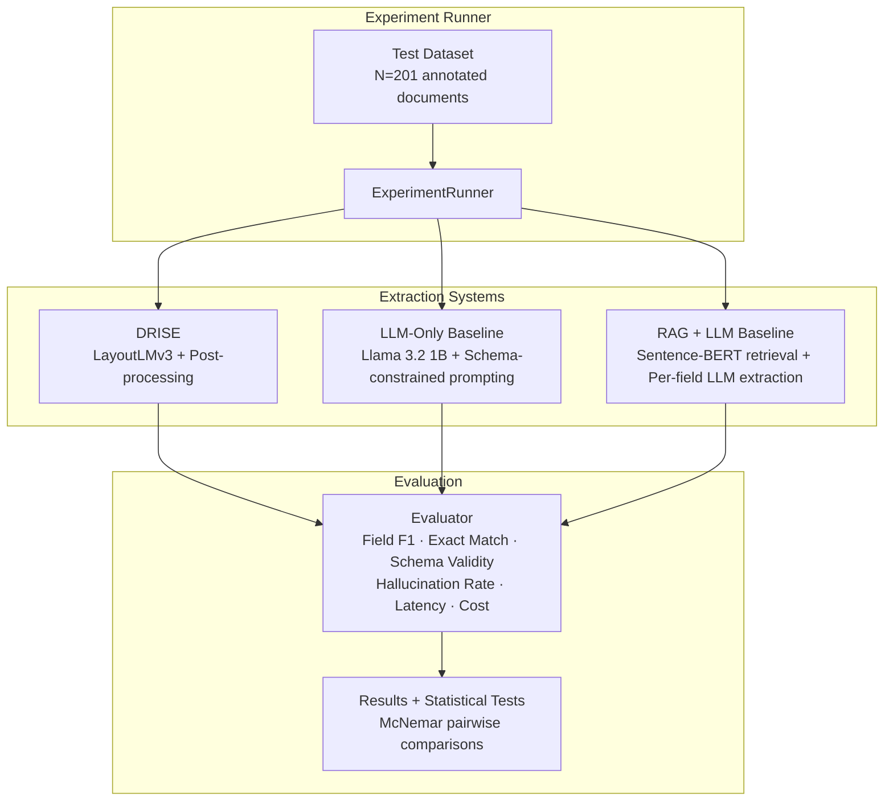

<div align="center">
  <h1>DRISE</h1>
  <p><strong>Document Retrieval & Intelligence with Structured Extraction</strong></p>
  <p><em>Layout-Aware Multimodal Document Parsing — PDF / Image → Validated Structured JSON</em></p>

  [](https://www.python.org/downloads/)
  [](https://pytorch.org/)
  [](https://huggingface.co/microsoft/layoutlmv3-base)
  [](https://fastapi.tiangolo.com)
  [](https://www.docker.com/)
  [](https://opensource.org/licenses/MIT)
</div>

---

## Table of Contents

- [Overview](#overview)
- [Key Capabilities](#key-capabilities)
- [System Architecture](#system-architecture)
- [Getting Started](#getting-started)
- [Docker Deployment](#docker-deployment)
- [API Reference](#api-reference)
- [Deterministic Post-Processing](#deterministic-post-processing)
- [Benchmark Results](#benchmark-results)
- [Ablation Studies](#ablation-studies)
- [Sensitivity Analysis](#sensitivity-analysis)
- [Reproducibility](#reproducibility)
- [Project Layout](#project-layout)
- [Fine-Tuning](#fine-tuning)
- [Known Limitations](#known-limitations)
- [Roadmap](#roadmap)
- [Contact](#contact)

---

## Overview

**DRISE** is a production-grade document intelligence system that transforms unstructured documents — invoices, receipts, scanned forms, PDFs — into validated, structured JSON with per-field confidence scores and cross-field consistency checks.

### The Problem

Existing approaches to document extraction fall short in complementary ways:

| Approach | Limitation |
|---|---|
| **OCR-only pipelines** | No spatial awareness — collapse on multi-column layouts, tables, and non-linear reading orders |
| **LLM-based extractors** | Non-deterministic outputs, hallucination risk, high per-document cost at scale |
| **Template-matching** | Brittle — breaks on layout variation, requires per-vendor configuration |

### The DRISE Approach

DRISE combines a **layout-aware multimodal transformer** (LayoutLMv3, which jointly encodes pixel content, text tokens, and bounding-box geometry) with a **deterministic post-processing pipeline** that normalizes, validates, and enforces cross-field constraints on every extraction. The result is a system that understands spatial document structure *and* guarantees identical output for identical input — no variance between runs.

---

## Key Capabilities

| Capability | Detail |
|---|---|
| **Layout-Aware Extraction** | LayoutLMv3 encodes bounding-box coordinates alongside text tokens, enabling the model to distinguish field labels from values across multi-column, tabular, and non-standard layouts |
| **Deterministic Post-Processing** | Every output passes through normalization (dates → ISO 8601, currencies → `float`), regex field validation, and a constraint engine (e.g., `Σ(line_items) ≈ total_amount`). Same input, same output — guaranteed |
| **Defense-in-Depth Security** | File uploads validated at extension, MIME type, and magic-byte level. Oversized files, malformed PDFs, and path-traversal attempts are rejected before processing begins |
| **Typed Data Contracts** | `ValidatedFile`, `OCRResult`, `ModelPrediction`, `ConstraintResult` — every pipeline stage communicates through explicit Pydantic interfaces |
| **Built-In Ablation Framework** | Controlled experiments with layout removal and constraint removal are implemented and runnable out of the box |
| **Multi-Model Support** | Swap between `microsoft/layoutlmv3-base`, `jinhybr/OCR-LayoutLMv3-Invoice`, or any fine-tuned checkpoint — the pipeline adapts automatically |
| **Production API** | FastAPI service with structured error mapping, per-request tracing IDs, batch parsing, health checks, and background file cleanup |

---

## System Architecture

### Processing Pipeline

```mermaid
graph LR
    subgraph Ingestion
        A[Upload] --> B[Validate<br/>Extension · MIME · Magic bytes · Size]
        B --> C[Rasterize<br/>PDF → page images]
    end

    subgraph Preprocessing
        C --> D[Normalize<br/>Resize · Denoise · Pixel norm]
    end

    subgraph OCR
        D --> E[PaddleOCR<br/>Tokens + Bounding boxes + Confidence]
    end

    subgraph "Model Inference"
        E --> F[LayoutLMv3<br/>Token classification<br/>KEY / VALUE / O labels]
    end

    subgraph "Post-Processing"
        F --> G[Normalize<br/>Dates · Currencies · OCR artifacts]
        G --> H[Validate<br/>Regex · Required fields · Types]
        H --> I[Constrain<br/>Cross-field consistency checks]
    end

    I --> J[Structured JSON<br/>Per-field confidence + Constraint flags]
```



### Data Flow

```
UploadFile
  → validate_upload()             # extension + MIME + magic bytes + size
  → load_pages()                  # PDF rasterization or image open
  → ImageNormalizationService     # deterministic page preparation
  → OCRService.extract()          # tokens + bounding boxes + confidence scores
  → LayoutLMv3InferenceService    # per-token field classification (KEY / VALUE / O)
  → normalize_document()          # date / currency / OCR artifact correction
  → validate_document()           # regex + semantic field checks
  → apply_constraints()           # cross-field consistency enforcement
  → DocumentParseResponse         # typed, validated JSON output
```

### Experiment Framework

For benchmarking purposes, DRISE includes two additional extraction pipelines that serve as controlled baselines:



---

## Getting Started

### Prerequisites

- Python 3.11+
- (Optional) Docker for containerized deployment
- (Optional) NVIDIA API key for LLM baseline experiments

### 1. Clone & Install

```bash
git clone https://github.com/purvanshh/DRISE-experiments.git
cd DRISE-experiments

python3.11 -m venv .venv && source .venv/bin/activate
pip install --upgrade pip
pip install -r requirements.txt
```

### 2. Configure

```bash
cp .env.example .env
# Edit .env — set model path, OCR backend, API settings
```

All settings support environment variable overrides with the `DIE_` prefix:

```bash
DIE_API__PORT=8080
DIE_OCR__MIN_CONFIDENCE=0.6
DIE_POSTPROCESSING__CONSTRAINTS__AMOUNT_TOLERANCE=0.02
```

### 3. Launch the API

```bash
uvicorn api.main:app --host 0.0.0.0 --port 8000 --reload
```

Interactive documentation is available at **[http://localhost:8000/docs](http://localhost:8000/docs)**.

### 4. Parse a Document

```bash
curl -X POST http://localhost:8000/parse-document \
     -F "file=@invoice.pdf"
```

---

## Docker Deployment

```bash
# Build and start the API
docker compose -f docker/docker-compose.yml up --build

# Include Redis for async processing
docker compose -f docker/docker-compose.yml --profile async up
```

The service will be available at **`http://localhost:8000`**.

---

## API Reference

Full interactive documentation is auto-generated at `http://localhost:8000/docs` when the server is running.

### Endpoints

| Method | Endpoint | Description |
|---|---|---|
| `GET` | `/health` | Liveness check with model readiness status |
| `POST` | `/parse-document` | Parse a single PDF or image |
| `POST` | `/parse-batch` | Parse multiple files in one request |

### Example Request

```bash
curl -X POST http://localhost:8000/parse-document \
     -F "file=@invoice.pdf" \
     -F "debug=false"
```

### Example Response

```json
{
  "document": {
    "invoice_number": { "value": "INV-1023",    "confidence": 0.924, "valid": true },
    "date":           { "value": "2025-01-12",   "confidence": 0.911, "valid": true },
    "vendor":         { "value": "ABC Pvt Ltd",  "confidence": 0.887, "valid": true },
    "total_amount":   { "value": 1200.50,        "confidence": 0.883, "valid": true },
    "line_items": {
      "value": [
        { "item": "Product A", "quantity": 2, "price": 400.00, "confidence": 0.871 }
      ],
      "valid": true
    },
    "_constraint_flags": [],
    "_errors": []
  },
  "metadata": {
    "filename": "invoice.pdf",
    "pages_processed": 1,
    "request_id": "req_01j9z..."
  }
}
```

### Error Codes

| HTTP Status | Cause |
|---|---|
| `400` | Invalid file type, malformed content, or size exceeded |
| `422` | Empty OCR output — no text detected in the document |
| `502` | OCR engine or model inference failure |
| `503` | Model backend unavailable |

---

## Deterministic Post-Processing

The post-processing layer is what makes DRISE production-ready rather than experimental. It runs three sequential stages on every extraction:

### Walkthrough: Invoice with OCR Artifacts

**Input** — A scanned invoice arrives with `total_amount: "$1,2OO.5O"` (OCR misread zeros as the letter O).

**Stage 1 — Normalization**
- OCR artifact correction identifies numeric context and applies character substitution: `O → 0`, `l → 1` where contextually appropriate
- Currency strings are parsed to native `float` (`1200.50`)
- Date strings are converted to ISO 8601 format

**Stage 2 — Field Validation**
- `invoice_number` is checked against the configured regex pattern
- `date` is validated for ISO format compliance
- `total_amount` is confirmed as a valid numeric type

**Stage 3 — Constraint Enforcement**
- `Σ(line_item.price × quantity)` is computed and compared to `total_amount` within the configured tolerance
- If a mismatch is detected, a `line_items_sum_mismatch` flag is appended — the output is returned, but the discrepancy is surfaced explicitly

**Result** — Every field carries an explicit `valid` boolean, a `confidence` score, and correction provenance. `_constraint_flags` lists any violated rules. Same invoice, same output, every time.

---

## Benchmark Results

### Test Configuration

All results below are from the latest full benchmark run with the following configuration:

| Parameter | Value |
|---|---|
| Test dataset | `data/annotations/test.jsonl` |
| Sample size | **N = 201** documents |
| DRISE model | `jinhybr/OCR-LayoutLMv3-Invoice` (published LayoutLMv3 checkpoint) |
| LLM baselines | NVIDIA backend with `meta/llama-3.2-1b-instruct` |
| Random seed | `42` (fixed across all systems) |
| Cost cap | `$30.00` (cumulative LLM spend limit) |

### System Comparison

| System | Field F1 | Exact Match | Schema Valid | Hallucination | Avg Latency (ms) | Cost/doc ($) | Total Cost ($) |
|---|---:|---:|---:|---:|---:|---:|---:|
| `llm_only` | 0.1677 | 0.0000 | 1.0000 | 0.0155 | 0.19 | 0.000368 | 0.073876 |
| `rag_llm` | 0.0000 | 0.0000 | 0.9701 | 0.0057 | 1.27 | 0.001648 | 0.331337 |
| **`drise`** | **0.5812** | **0.0498** | **1.0000** | 0.0680 | 301.89 | 0.000042 | 0.008429 |
| `drise_no_layout` | 0.5667 | 0.0498 | 1.0000 | 0.0351 | 363.07 | 0.000050 | 0.010136 |
| `drise_no_constraints` | 0.5812 | 0.0498 | 1.0000 | 0.0680 | 396.72 | 0.000055 | 0.011087 |

### Key Takeaways

- **DRISE leads on extraction quality** — `0.5812` field-level F1 versus `0.1677` for the LLM-only baseline and `0.0000` for RAG+LLM, representing a **3.5× improvement** over the strongest baseline.
- **Non-zero exact match** — DRISE achieves `0.0498` exact-match on the held-out test split, sufficient for meaningful McNemar comparison against both LLM baselines (`p = 0.004427`).
- **100% schema validity** — DRISE produces structurally valid output on every document while remaining the cheapest system in the benchmark at approximately `$0.000042` per document.
- **Strong on structured fields** — DRISE reaches `0.6734` mean field F1 on `line_items` and `0.6020` on `total_amount`, where text-only baselines consistently fail.
- **Calibrated hallucination measurement** — Macro document-mean hallucination rate of `0.0680`; micro checked-field rate of `0.0629`.

### Statistical Significance

All pairwise comparisons use McNemar's exact test on document-level exact-match outcomes:

| Comparison | p-value | Significant |
|---|---:|:---:|
| `drise` vs `llm_only` | 0.004427 | ✅ |
| `drise` vs `rag_llm` | 0.004427 | ✅ |
| `llm_only` vs `rag_llm` | 1.000000 | — |

---

## Ablation Studies

Two controlled ablations isolate the contribution of individual DRISE components:

| Experiment | Component Removed | What It Measures |
|---|---|---|
| `drise_no_layout` | Bounding-box encoding | Value of spatial features when a real model checkpoint is available |
| `drise_no_constraints` | Deterministic constraint application | Impact of cross-field validation and guardrails |

### Ablation Deltas vs Full DRISE

| Variant | ΔF1 | ΔExact Match | ΔSchema Valid | ΔHallucination |
|---|---:|---:|---:|---:|
| `drise_no_layout` | -0.0144 | 0.0000 | 0.0000 | -0.0329 |
| `drise_no_constraints` | 0.0000 | 0.0000 | 0.0000 | 0.0000 |

### Interpretation

- **Layout features contribute ~1.4 F1 points** overall. The most layout-sensitive field is `total_amount`, which drops from `0.6020` to `0.5174` mean field F1 without spatial encoding.
- **Constraints act as a diagnostic guardrail** — disabling them does not change scored extraction fields on this dataset, but collapses the `constraint_flag_rate` from `0.9900` to `0.0000`. The constraint layer is surfacing inconsistencies rather than repairing extractions.
- The exact-match signal is still too sparse to distinguish DRISE from its ablations at the document level (`p = 1.0`), so the ablation analysis relies primarily on field-level metrics.

---

## Sensitivity Analysis

Live sensitivity experiments measure system robustness under controlled perturbation on a **20-document** subset:

### Temperature Sensitivity (LLM Baselines)

| System | Temp 0.0 → F1 | Temp 0.7 → F1 | Schema Valid @ 0.7 |
|---|---:|---:|---:|
| `llm_only` | 0.191 | 0.342 | 0.800 |
| `rag_llm` | — | 0.040 | 0.150 |

Higher temperature improves `llm_only` extraction recall but at the cost of schema validity — a classic precision–reliability tradeoff.

### OCR Noise Robustness

| System | Noise 0.0 → F1 | Noise 0.2 → F1 | Relative Degradation |
|---|---:|---:|---:|
| `drise` | 0.390 | 0.298 | -23.6% |
| `llm_only` | 0.191 | 0.073 | -61.8% |

DRISE degrades **significantly more gracefully** under OCR corruption than the LLM-only baseline, retaining nearly 4× the extraction quality at the highest noise level.

---

## Reproducibility

All experiments are fully reproducible:

- **Pinned dependencies**: [`requirements.txt`](requirements.txt) with exact version locks
- **Fixed random seeds**: All systems seeded at `42` (Python, NumPy, PyTorch)
- **Deterministic caching**: LLM responses and retrieval embeddings are cached to disk
- **Cost guardrails**: Benchmark aborts if cumulative LLM cost exceeds `$30.00`

### Containerized Benchmark

```bash
docker build -t drise-benchmark .
docker run \
  -e NVIDIA_API_KEY=$NVIDIA_API_KEY \
  -v "$(pwd)/data:/app/data" \
  -v "$(pwd)/experiments:/app/experiments" \
  drise-benchmark
```

> **Note:** The container mounts the full `data/` directory (not just `data/annotations/`) because annotation files reference source images under `data/raw/`. The `load_annotations()` function automatically rebases absolute host paths for the container's `/app` root.

### Exported Artifacts

| Artifact | Path |
|---|---|
| Summary table | `experiments/results/summary.csv` |
| Per-system results | `experiments/results/{system}.json` |
| Ablation deltas | `experiments/results/ablation_summary.csv` |
| Pairwise statistics | `experiments/results/pairwise_stats.json` |
| Hallucination calibration | `experiments/results/hallucination_calibration.json` |
| Experiment report | `experiments/results/report.json` |

---

## Project Layout

```
.
├── configs/
│   ├── config.yaml                # Model, OCR, API, and post-processing configuration
│   └── experiments.yaml           # Benchmark experiment definitions
├── data/
│   ├── raw/                       # Source PDFs and images                    [gitignored]
│   ├── processed/                 # Intermediate processing artifacts         [gitignored]
│   └── annotations/               # Ground-truth labels (JSONL)              [gitignored]
├── docker/
│   ├── Dockerfile                 # Production container
│   └── docker-compose.yml         # Service orchestration with optional Redis
├── experiments/
│   ├── runs/                      # Experiment run metadata                   [gitignored]
│   ├── artifacts/                 # Model checkpoints                         [gitignored]
│   ├── cache/                     # LLM + retrieval response caches           [gitignored]
│   └── results/                   # Benchmark outputs, charts, and reports
├── src/
│   ├── document_intelligence_engine/
│   │   ├── api/                   # FastAPI app, routes, schemas, middleware
│   │   ├── core/                  # Configuration loader, structured logger, error hierarchy
│   │   ├── domain/                # Typed Pydantic data contracts
│   │   ├── data/                  # Annotation loading and dataset utilities
│   │   ├── ingestion/             # File validation, PDF rasterization
│   │   ├── preprocessing/         # Image normalization (resize, denoise, pixel norm)
│   │   ├── ocr/                   # PaddleOCR wrapper with backend protocol
│   │   ├── multimodal/            # LayoutLMv3 inference + CORD fine-tuning hooks
│   │   ├── llm/                   # LLM client, prompt templates, response parsing
│   │   ├── retrieval/             # Sentence-BERT embedder + cosine-similarity retriever
│   │   ├── postprocessing/        # Normalization → Validation → Constraint enforcement
│   │   ├── pipelines/             # DRISE, LLM-only, and RAG+LLM experiment pipelines
│   │   ├── evaluation/            # Metrics, evaluator, experiment runner, report generation
│   │   ├── services/              # End-to-end pipeline orchestration and model runtime
│   │   └── testing/               # Test harness and fixtures
│   ├── ingestion/                 # Standalone ingestion pipeline module
│   ├── ocr/                       # Standalone OCR module
│   ├── preprocessing/             # Standalone preprocessing module
│   ├── postprocessing/            # Standalone post-processing module
│   └── evaluation/                # Standalone evaluation module
├── tests/
│   ├── unit/                      # Unit tests
│   ├── integration/               # Integration tests
│   ├── load/                      # Load and performance tests
│   ├── security/                  # Security validation tests
│   └── stress/                    # Stress and failure-mode tests
├── scripts/                       # CLI tools, benchmarking scripts, dataset converters
├── run_experiments.py             # Experiment harness entry point
├── pyproject.toml                 # Tooling configuration (ruff, black, pytest)
└── requirements.txt               # Pinned dependencies
```

---

## Fine-Tuning

DRISE supports fine-tuning LayoutLMv3 on custom document datasets:

```bash
# Configure training parameters in .env or configs/config.yaml, then:
python -m document_intelligence_engine.multimodal.training
```

### Supported Datasets

| Dataset | Domain | Description |
|---|---|---|
| [FUNSD](https://guillaumejaume.github.io/FUNSD/) | Forms | Form understanding on noisy scanned documents |
| [CORD](https://github.com/clovaai/cord) | Receipts | Receipt parsing with structured line items |

Training configuration (learning rate, epochs, warmup, gradient accumulation) is managed through `configs/config.yaml` under the `training` section.

---

## Known Limitations

| Limitation | Detail |
|---|---|
| **OCR ceiling** | Severely degraded scans (heavy noise, sub-100 DPI, mixed orientation) produce low-confidence tokens that downstream models cannot reliably recover |
| **Domain generalization** | Fine-tuned on FUNSD and CORD; performance on domain-specific document types (legal, medical, multilingual) will degrade without targeted fine-tuning |
| **Multi-page joining** | Pages are processed independently — cross-page field references (e.g., total on page 2 referencing items on page 1) are not currently resolved |
| **Table structure** | Table cells are extracted, but row/column/span relationships are not reconstructed in the output schema |

---

## Roadmap

- [ ] Table structure reconstruction from detected cell bounding boxes
- [ ] Cross-page field joining for multi-page documents
- [ ] Multilingual document support (Arabic, CJK scripts)
- [ ] Confidence calibration via temperature scaling post fine-tuning
- [ ] Active learning loop — route low-confidence outputs to human review and feed corrections back into training data

---

## Contact

Designed and built by **Purvansh Sahu**.

If you find this project useful or have suggestions, feel free to open an issue or reach out directly.

- **GitHub**: [@purvanshh](https://github.com/purvanshh)
- **Email**: purvanshhsahu@gmail.com
