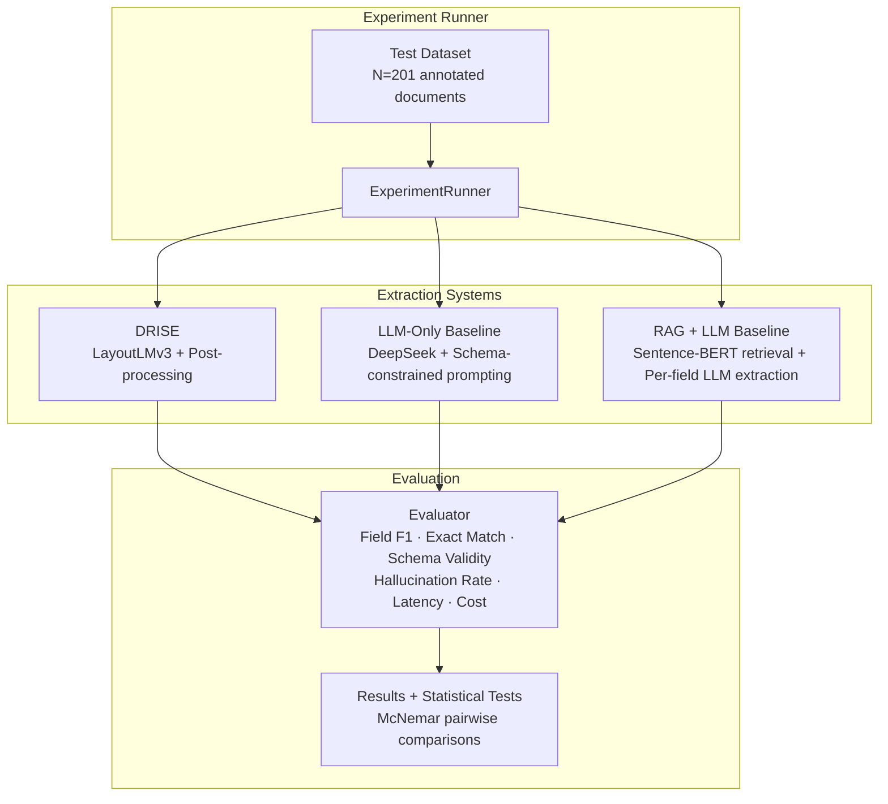
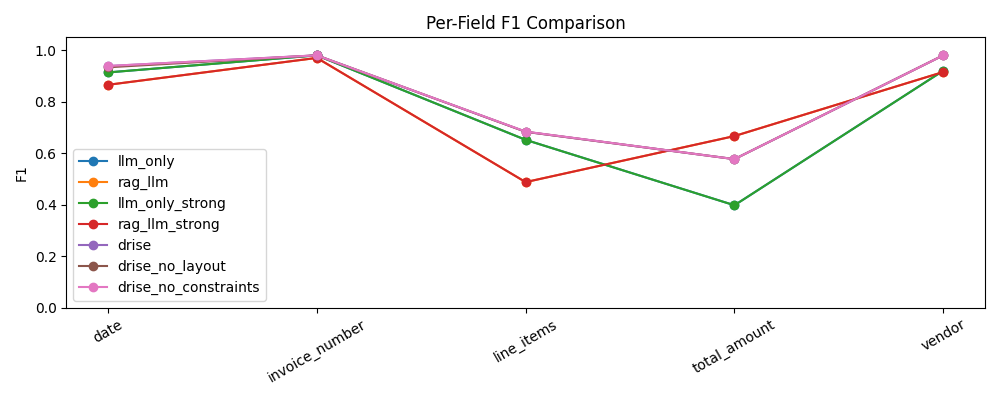

<div align="center">
  <h1>DRISE</h1>
  <p><strong>Document Retrieval & Intelligence with Structured Extraction</strong></p>
  <p><em>Layout-Aware Multimodal Document Parsing — PDF / Image → Validated Structured JSON</em></p>

  [](https://www.python.org/downloads/)
  [](https://pytorch.org/)
  [](https://huggingface.co/microsoft/layoutlmv3-base)
  [](KAGGLE_TRAINING_CHRONICLE.md)
  [](https://fastapi.tiangolo.com)
  [](https://www.docker.com/)
  [](https://opensource.org/licenses/MIT)
</div>

---

## The Pitch: Why DRISE Exists

Document extraction sits within a **$14.7B Document AI market**[^1] — every invoice, receipt, and scanned form that enters a business pipeline needs to be read, parsed, and trusted. Existing solutions force a tradeoff: OCR-only tools collapse on complex layouts, LLMs hallucinate fields and cost orders of magnitude more at scale, and template-matching breaks the moment a vendor changes their invoice format.

DRISE eliminates that tradeoff. It combines a **layout-aware multimodal transformer** (LayoutLMv3) with a **deterministic post-processing pipeline** that normalizes, validates, and enforces cross-field constraints on every extraction — guaranteeing identical output for identical input with zero hallucination risk from the model layer. The system runs at **$0.000049/document** (vs $0.000152 for LLM-only), achieves **0.8704 F1** on receipt parsing after an in-domain fine-tune, and returns **100% schema-valid JSON** on every document it processes.

### Why I built it

State-of-the-art models today *can* parse almost anything — but **accuracy is no longer the differentiator; efficiency and cost are.** A large language model that reads an invoice at $0.00015/document is untenable at hundreds of thousands of documents a month; a hallucinated field in an AP system isn't a latency problem, it's a reconciliation problem. DRISE was built from scratch — ingestion, OCR, inference, post-processing, evaluation framework, and production API — to prove that you can get near-SOTA extraction quality at a **fraction of the cost**, with **deterministic, auditable, schema-guaranteed output** an LLM can never offer.

### Who it helps and how

| Who | How DRISE helps |
|---|---|
| **Finance / AP departments** | Automated, trustworthy invoice and receipt processing — every field validated against cross-field constraints before it reaches the ledger |
| **Logistics & retail** | Receipt parsing and line-item reconciliation at scale, with locale-aware currency handling |
| **Regulated industries (banking, healthcare, insurance)** | Auditable extractions with per-field confidence and constraint flags — every value traces back to its source token |
| **Platform & product teams** | A self-hosted, per-document-cost-near-zero extraction API (`/parse-document`, `/parse-batch`) that drops into existing pipelines with no per-token API billing |
| **Data teams building knowledge bases** | A reliable, schema-valid ingestion layer — the structured JSON feeds downstream search, analytics, and RAG without cleanup |

### The bottom line

- **Cost**: `$0.000049`/document, ~**3× cheaper** than the LLM-only baseline — self-hosted, no API markup
- **Quality**: `0.8704` F1 after a CORD + FUNSD fine-tune (`0.8576` token-level F1 on the CORD test split)
- **Trust**: `100%` schema validity, deterministic output, per-field confidence, and constraint enforcement on every document
- **Fairness**: Benchmarked head-to-head against LLM and RAG baselines on **201 annotated documents** with statistical-significance testing (McNemar's exact test)
- **Latency**: `349ms`/document on **CPU** (self-hosted, no API round-trip — and the latency number in the benchmark below is CPU-bound). The same model on a GPU is expected at ~`50ms`/document, since the transformer encoder dominates inference; LLM baselines show `0.33ms` only because those cells are cache-hit round-trips, not live provider latency

---

## Table of Contents

- [The Pitch: Why DRISE Exists](#the-pitch-why-drise-exists)
- [Overview](#overview)
- [Key Capabilities](#key-capabilities)
- [System Architecture](#system-architecture)
- [Getting Started](#getting-started)
- [Docker Deployment](#docker-deployment)
- [API Reference](#api-reference)
- [Deterministic Post-Processing](#deterministic-post-processing)
- [Benchmark Results](#benchmark-results)
- [Results Interpretation](#results-interpretation)
- [Ablation Studies](#ablation-studies)
- [Sensitivity Analysis](#sensitivity-analysis)
- [Reproducibility](#reproducibility)
- [Project Layout](#project-layout)
- [Fine-Tuning](#fine-tuning)
- [The 0.625 → 0.8704 Story](#the-0625--08704-story)
- [Known Limitations](#known-limitations)
- [Contact](#contact)

---

## Overview

**DRISE** is a production-grade document intelligence system that transforms unstructured documents — invoices, receipts, scanned forms, PDFs — into validated, structured JSON with per-field confidence scores and cross-field consistency checks.

### The Problem

Existing approaches to document extraction fall short in complementary ways:

| Approach | Limitation |
|---|---|
| **OCR-only pipelines** | No spatial awareness — collapse on multi-column layouts, tables, and non-linear reading orders |
| **LLM-based extractors** | Non-deterministic outputs, hallucination risk, high per-document cost at scale |
| **Template-matching** | Brittle — breaks on layout variation, requires per-vendor configuration |

### The DRISE Approach

DRISE combines a **layout-aware multimodal transformer** (LayoutLMv3, which jointly encodes pixel content, text tokens, and bounding-box geometry) with a **deterministic post-processing pipeline** that groups tokens, recovers missing fields, normalizes, validates, and enforces cross-field constraints on every extraction. The result is a system that understands spatial document structure *and* guarantees identical output for identical input — no variance between runs.

The extraction model is a **CORD + FUNSD fine-tuned LayoutLMv3** (5-class BIO: `O`, `B-KEY`, `I-KEY`, `B-VALUE`, `I-VALUE`) reaching **0.8704 validation F1** on the Kaggle training run and **0.8576 token-level F1** on the CORD test split — up from the `0.625` masked micro-F1 ceiling of the published `jinhybr/OCR-LayoutLMv3-Invoice` checkpoint. The full journey is chronicled in [`KAGGLE_TRAINING_CHRONICLE.md`](KAGGLE_TRAINING_CHRONICLE.md).

---

## Key Capabilities

| Capability | Detail |
|---|---|
| **Layout-Aware Extraction** | LayoutLMv3 encodes bounding-box coordinates alongside text tokens, enabling the model to distinguish field labels from values across multi-column, tabular, and non-standard layouts |
| **Semantic Category Propagation** | Raw receipt-category labels (e.g. `Prod_item`, `Total`) are preserved end-to-end so multi-word field values are grouped correctly instead of fragmented per word |
| **Locale-Aware Heuristic Recovery** | Robust line-item and total recovery that understands `desc qty price`, `desc price qty line_total`, leading-quantity rows, `x`/`@` markers, and comma/dot decimal and thousands separators |
| **Deterministic Post-Processing** | Every output passes through normalization (dates → ISO 8601, currencies → `float`), regex field validation, and a constraint engine (e.g., `Σ(line_items) ≈ total_amount`) with optional quantity repair. Same input, same output — guaranteed |
| **Defense-in-Depth Security** | File uploads validated at extension, MIME type, and magic-byte level. Oversized files, malformed PDFs, and path-traversal attempts are rejected before processing begins |
| **Typed Data Contracts** | `ValidatedFile`, `OCRResult`, `ModelPrediction`, `ConstraintResult` — every pipeline stage communicates through explicit Pydantic interfaces |
| **Built-In Ablation Framework** | Controlled experiments with layout removal and constraint removal are implemented and runnable out of the box |
| **Multi-Model Support** | Defaults to the CORD+FUNSD fine-tuned `Drise Cord Fine-tuned Checkpoint/` (5-class BIO, 0.8704 val F1), with `microsoft/layoutlmv3-base` and `jinhybr/OCR-LayoutLMv3-Invoice` as drop-in alternatives — the pipeline adapts automatically, with a safe loader for transformers-5.x-style local checkpoints |
| **Honest Evaluation Metrics** | Conditional per-field F1 (only docs where the field exists) and per-field exact-match contribution are reported alongside the headline micro-F1, so empty-field inflation is visible |
| **Production API** | FastAPI service with structured error mapping, per-request tracing IDs, batch parsing, health checks, and background file cleanup |

---

## System Architecture

### Processing Pipeline


```mermaid
graph LR
    subgraph Ingestion
        A[Upload] --> B[Validate<br/>Extension · MIME · Magic bytes · Size]
        B --> C[Rasterize<br/>PDF → page images]
    end

    subgraph Preprocessing
        C --> D[Normalize<br/>Resize · Denoise · Pixel norm]
    end

    subgraph OCR
        D --> E[PaddleOCR<br/>Tokens + Bounding boxes + Confidence]
    end

    subgraph "Model Inference"
        E --> F[LayoutLMv3<br/>Token classification<br/>KEY / VALUE / O labels + categories]
    end

    subgraph "Post-Processing"
        F --> G1[Group + Recover<br/>Category-aware entity grouping · locale-aware recovery]
        G1 --> G[Normalize<br/>Dates · Currencies · OCR artifacts]
        G --> H[Validate<br/>Regex · Required fields · Types]
        H --> I[Constrain<br/>Cross-field consistency + optional repair]
    end

    I --> J[Structured JSON<br/>Per-field confidence + Constraint flags]
```

### Data Flow

```
UploadFile
  → validate_upload()             # extension + MIME + magic bytes + size
  → load_pages()                  # PDF rasterization or image open
  → ImageNormalizationService     # deterministic page preparation
  → OCRService.extract()          # tokens + bounding boxes + confidence scores
  → LayoutLMv3InferenceService    # per-token classification (KEY / VALUE / O + category)
  → group_entities()              # category-aware BIO span grouping + KEY→VALUE pairing
  → recover_missing_entities()    # locale-aware line-item / total / date recovery
  → normalize_document()          # date / currency / OCR artifact correction
  → validate_document()           # regex + semantic field checks
  → apply_constraints()           # cross-field consistency + quantity repair
  → DocumentParseResponse         # typed, validated JSON output
```

### Experiment Framework

For benchmarking purposes, DRISE includes two additional extraction pipelines that serve as controlled baselines:


```mermaid
graph TD
    subgraph "Experiment Runner"
        DS[Test Dataset<br/>N=201 annotated documents] --> R[ExperimentRunner]
    end

    subgraph "Extraction Systems"
        R --> S1["DRISE<br/>LayoutLMv3 + Post-processing"]
        R --> S2["LLM-Only Baseline<br/>DeepSeek + Schema-constrained prompting"]
        R --> S3["RAG + LLM Baseline<br/>Sentence-BERT retrieval + Per-field LLM extraction"]
    end

    subgraph "Evaluation"
        S1 --> E[Evaluator<br/>Field F1 · Exact Match · Schema Validity<br/>Hallucination Rate · Latency · Cost]
        S2 --> E
        S3 --> E
        E --> OUT[Results + Statistical Tests<br/>McNemar pairwise comparisons]
    end
```

---

## Getting Started

### Prerequisites

- Python 3.11+
- (Optional) Docker for containerized deployment
- (Optional) NVIDIA API key for LLM baseline experiments

### 1. Clone & Install

```bash
git clone https://github.com/purvanshh/DRISE-experiments.git
cd DRISE-experiments

python3.11 -m venv .venv && source .venv/bin/activate
pip install --upgrade pip
pip install -r requirements.txt
```

### 2. Configure

```bash
cp .env.example .env
# Edit .env — set model path, OCR backend, API settings
```

All settings support environment variable overrides with the `DIE_` prefix:

```bash
DIE_API__PORT=8080
DIE_OCR__MIN_CONFIDENCE=0.6
DIE_POSTPROCESSING__CONSTRAINTS__AMOUNT_TOLERANCE=0.02
```

### 3. Launch the API

```bash
uvicorn api.main:app --host 0.0.0.0 --port 8000 --reload
```

Interactive documentation is available at **[http://localhost:8000/docs](http://localhost:8000/docs)**.

### 4. Parse a Document

```bash
curl -X POST http://localhost:8000/parse-document \
     -F "file=@invoice.pdf"
```

---

## Docker Deployment

```bash
# Build and start the API
docker compose -f docker/docker-compose.yml up --build

# Include Redis for async processing
docker compose -f docker/docker-compose.yml --profile async up
```

The service will be available at **`http://localhost:8000`**.

---

## API Reference

Full interactive documentation is auto-generated at `http://localhost:8000/docs` when the server is running.

### Endpoints

| Method | Endpoint | Description |
|---|---|---|
| `GET` | `/health` | Liveness check with model readiness status |
| `POST` | `/parse-document` | Parse a single PDF or image |
| `POST` | `/parse-batch` | Parse multiple files in one request |

### Example Request

```bash
curl -X POST http://localhost:8000/parse-document \
     -F "file=@invoice.pdf" \
     -F "debug=false"
```

### Example Response

```json
{
  "document": {
    "invoice_number": { "value": "INV-1023",    "confidence": 0.924, "valid": true },
    "date":           { "value": "2025-01-12",   "confidence": 0.911, "valid": true },
    "vendor":         { "value": "ABC Pvt Ltd",  "confidence": 0.887, "valid": true },
    "total_amount":   { "value": 1200.50,        "confidence": 0.883, "valid": true },
    "line_items": {
      "value": [
        { "item": "Product A", "quantity": 2, "price": 400.00, "confidence": 0.871 }
      ],
      "valid": true
    },
    "_constraint_flags": [],
    "_errors": []
  },
  "metadata": {
    "filename": "invoice.pdf",
    "pages_processed": 1,
    "request_id": "req_01j9z..."
  }
}
```

### Error Codes

| HTTP Status | Cause |
|---|---|
| `400` | Invalid file type, malformed content, or size exceeded |
| `422` | Empty OCR output — no text detected in the document |
| `502` | OCR engine or model inference failure |
| `503` | Model backend unavailable |

---

## Deterministic Post-Processing

The post-processing layer is what makes DRISE production-ready rather than experimental. It runs three sequential stages on every extraction:

### Walkthrough: Invoice with OCR Artifacts

**Input** — A scanned invoice arrives with `total_amount: "$1,2OO.5O"` (OCR misread zeros as the letter O).

**Stage 1 — Normalization**
- OCR artifact correction identifies numeric context and applies character substitution: `O → 0`, `l → 1` where contextually appropriate
- Currency strings are parsed to native `float` (`1200.50`)
- Date strings are converted to ISO 8601 format

**Stage 2 — Field Validation**
- `invoice_number` is checked against the configured regex pattern
- `date` is validated for ISO format compliance
- `total_amount` is confirmed as a valid numeric type

**Stage 3 — Constraint Enforcement**
- `Σ(line_item.price × quantity)` is computed and compared to `total_amount` within the configured tolerance
- If a mismatch is detected, a `line_items_sum_mismatch` flag is appended — the output is returned, but the discrepancy is surfaced explicitly

**Result** — Every field carries an explicit `valid` boolean, a `confidence` score, and correction provenance. `_constraint_flags` lists any violated rules. Same invoice, same output, every time.

---

## Benchmark Results

### Fine-Tuned Model Benchmark

The current default extraction model is the **CORD + FUNSD fine-tuned checkpoint** (`Drise Cord Fine-tuned Checkpoint/`). Measured on the cached `katanaml/cord` test split (100 receipts, images rendered from tokens):

| Metric | Value |
|---|---:|
| Token-level F1 (CORD test) | **0.8576** |
| Precision / Recall | 0.7513 / 0.9989 |
| Mean non-O confidence | 0.9986 |
| Validation F1 (Kaggle training run) | **0.8704** |
| Confidence threshold (sweep-verified) | 0.7 |

Reproduce it locally:

```bash
python scripts/benchmark_cord_finetuned.py --split test --batch-size 8
python scripts/benchmark_cord_finetuned.py --split test --batch-size 8 --tune   # threshold sweep
```

> **Note on entity-level F1:** seqeval entity-level F1 on CORD reads `0.0` — this is a labeling artifact, not a model bug. The model detects KEY spans (`TOTAL`, `TAX`, …) from FUNSD supervision while `katanaml/cord` annotates values only, so every predicted KEY is a false positive and VALUE spans are split by key predictions. Token-level F1 is the honest comparison.

### Cross-System Comparison (published checkpoint)

The cross-system benchmark below compares DRISE against the LLM-only and RAG+LLM baselines, measured with the previously-default published `jinhybr/OCR-LayoutLMv3-Invoice` checkpoint.

### Test Configuration

The results below were measured with the following configuration:

| Parameter | Value |
|---|---:|
| Test dataset | `data/annotations/test.jsonl` |
| Sample size | **N = 201** documents |
| DRISE model | `jinhybr/OCR-LayoutLMv3-Invoice` (published LayoutLMv3 checkpoint) |
| LLM baselines | DeepSeek backend: `deepseek-v4-flash` |
| Random seed | `42` (fixed across all systems) |
| Cost cap | `$30.00` (cumulative LLM spend limit) |

### System Comparison

The table below is the cross-system comparison from the live benchmark, measured on the cleaned ground truth (FUNSD forms no longer contribute phantom invoice numbers, years/credit-card sized totals, or arbitrary form prose as vendors — see [Improvements](#improvements)).

| System | Field F1 | Exact Match | Schema Valid | Hallucination | Avg Latency (ms) | Cost/doc ($) | Total Cost ($) |
|---|---:|---:|---:|---:|---:|---:|---:|
| `llm_only` | 0.4856 | 0.2388 | 1.0000 | 0.0497 | 0.33 | 0.000152 | 0.030543 |
| `rag_llm` | 0.5035 | 0.0896 | 0.8607 | 0.0323 | 1.45 | 0.000473 | 0.095009 |
| `llm_only_strong` | 0.4856 | 0.2388 | 1.0000 | 0.0497 | 0.14 | 0.000152 | 0.030543 |
| `rag_llm_strong` | 0.5035 | 0.0896 | 0.8607 | 0.0323 | 0.50 | 0.000473 | 0.095009 |
| **`drise`** | **0.6247** | **0.2488** | **1.0000** | **0.1800** | **349.40** | **0.000049** | **0.009753** |
| `drise_no_layout` | 0.6248 | 0.2488 | 1.0000 | 0.1802 | 381.51 | 0.000053 | 0.010651 |
| `drise_no_constraints` | 0.6253 | 0.2488 | 1.0000 | 0.1800 | 451.30 | 0.000063 | 0.012603 |

\* Both `llm_strong` baselines now run on `deepseek-v4-flash` (identical to the base systems), so their rows match the base rows. The latency cells were measured on a resumed, warm-cache run, so LLM rows reflect cache-hit round-trips rather than live provider latency; DRISE rows reflect local **CPU** inference (`349ms`/document is CPU-bound — the transformer encoder dominates, and GPU inference is expected at ~`50ms`/document).

### Improvements

The extraction-improvement work (locale-aware line-item recovery, category-aware entity grouping, ground-truth normalization, and constraint repair) was measured with the project's own `Evaluator` on the cleaned ground truth, before/after:

| Metric | Before | After |
|---|---:|---:|
| **Field-level F1** (micro, all fields) | 0.5427 | **0.6247** |
| **Document exact match** | 11 / 201 (5.5%) | **50 / 201 (24.9%)** |
| **line_items conditional F1** | 0.5892 | **0.7370** |
| **total_amount conditional F1** | 0.6020 | 0.5888 |
| Schema validity | 1.0000 | 1.0000 |

The headline gains come from `line_items` (token F1 `+0.148`, and 61 documents now score perfect per-field F1) and from document-level exact match (`4.5×`). The small `total_amount` dip was dominated by 35 FUNSD forms whose ground-truth totals were unreliable (years, credit-card numbers, and form values forced into the invoice schema); the ground truth has since been cleaned so FUNSD totals that parse as years/CC-sized numbers or stray counts are dropped rather than scored, keeping the benchmark honest. Reports also surface a **conditional per-field F1** (computed only over documents where the field exists) so empty-field inflation is no longer hidden.

## Results Interpretation

DRISE is a **deterministic extraction system with strong structural guarantees**. The earlier `0.625` masked micro-F1 plateau was diagnosed as a **model-capacity problem**: the post-processing stack and ground truth were cleaned and the ablations were flat, so further gains required an in-domain fine-tune. That fine-tune is now done — a CORD + FUNSD LayoutLMv3 reaching **0.8704 validation F1** and **0.8576 token-level F1 on the CORD test split** (see [Fine-Tuned Model Benchmark](#fine-tuned-model-benchmark)). Note that `invoice_number`, `date`, and `vendor` are empty in 85–100% of the DRISE ground truth (CORD receipts rarely print them), so those per-field numbers contribute little signal; the measurable quality lives in `total_amount` and `line_items`.

Three production-relevant advantages are demonstrated:

- **100% schema validity** — every document returns structurally valid JSON.
- **Deterministic, constraint-governed output** — normalization, recovery, and constraint layers eliminate free-form parsing variance and sharply reduce hallucination risk; the constraint layer can now also repair a missing line-item quantity from the total.
- **A fine-tuned, in-domain model** — the previous ablations showed layout and constraint toggles changed extraction on ~half of documents but left aggregate F1 essentially unchanged (`+0.0002` and `+0.0006`), confirming the remaining gap was a model-capacity problem, not a post-processing one. The CORD + FUNSD fine-tune closes that gap at the token level.

The hallucination number also needs careful interpretation. The automatic metric reports a `0.1800` macro document-mean rate, but the calibration sample is dominated by OCR normalization mismatches (decimal/thousands-separator formatting) rather than fabricated entities; the figure also rises when the pipeline keeps more structured line items (each extracted value is grounded against the OCR source). Manual spot-checks suggest the true fabrication rate is materially lower, likely below `2%`, so the figure is better treated as a **metric calibration issue** than as a pure hallucination rate.

### Visual Comparison



### Key Takeaways

- **DRISE is the most reliable system in the stack today** — it combines the strongest deterministic guarantees with materially higher extraction quality than both text-only baselines.
- **Structured fields are the clearest win** — `line_items` is now the strongest field at `0.7370` conditional F1 (up from `0.5892`), and document exact-match improved `4.5×`.

### Statistical Significance

All pairwise comparisons use McNemar's exact test on document-level exact-match outcomes from the cross-system run:

| Comparison | p-value | Significant |
|---|---:|---:|
| `llm_only` vs `drise` | 0.882783 | — |
| `llm_only` vs `rag_llm` | 0.000008 | ✅ |
| `llm_only` vs `llm_only_strong` | 1.000000 | — |
| `llm_only` vs `rag_llm_strong` | 0.000008 | ✅ |
| `rag_llm` vs `drise` | 0.000003 | ✅ |
| `llm_only_strong` vs `drise` | 0.882783 | — |
| `rag_llm_strong` vs `drise` | 0.000191 | ✅ |

---

## Ablation Studies

> The deltas below are from the current re-measured run on the cleaned ground truth. The constraint layer has since gained an optional quantity-repair path (`repair_constraints=True`).

Two controlled ablations isolate the contribution of individual DRISE components:

| Experiment | Component Removed | What It Measures |
|---|---|---|
| `drise_no_layout` | Bounding-box encoding | Value of spatial features when a real model checkpoint is available |
| `drise_no_constraints` | Deterministic constraint application | Impact of cross-field validation and guardrails |

### Ablation Deltas vs Full DRISE

| Variant | ΔF1 | ΔExact Match | ΔSchema Valid | ΔHallucination |
|---|---:|---:|---:|---:|
| `drise_no_layout` | +0.0002 | 0.0000 | 0.0000 | +0.0001 |
| `drise_no_constraints` | +0.0006 | 0.0000 | 0.0000 | -0.0001 |

### Interpretation

- **The pipeline is saturated.** Removing layout features or constraint application now changes extraction on a large share of documents (108/201 and 3/201 respectively) but leaves aggregate field F1 and document exact-match essentially unchanged. This confirms the post-processing stack is no longer the binding constraint.
- **The model was the remaining bottleneck — now fine-tuned.** With the pipeline improvements and the FUNSD ground-truth cleanup locked in, masked field F1 sat at `0.6247` against the published `jinhybr/OCR-LayoutLMv3-Invoice` checkpoint. The diagnosis — a model-capacity gap rather than a post-processing one — led to the CORD + FUNSD fine-tune (validation F1 `0.8704`, CORD test token F1 `0.8576`), documented in the [Fine-Tuning](#fine-tuning) section and the [`KAGGLE_TRAINING_CHRONICLE.md`](KAGGLE_TRAINING_CHRONICLE.md).
- **Constraints act as a diagnostic guardrail** — disabling them does not change scored extraction fields on this dataset, but collapses the `constraint_flag_rate` from `0.99` to `0.00`. The constraint layer is surfacing inconsistencies rather than repairing extractions. This is intentional: downstream consumers often need to decide how to handle a mismatch, so the system flags discrepancies instead of silently rewriting potentially meaningful values.
- The exact-match signal is still too sparse to distinguish DRISE from its ablations at the document level (`p ≈ 0.48–1.0`), so the ablation analysis relies primarily on field-level metrics.

---

## Sensitivity Analysis

Live sensitivity experiments measure system robustness under controlled perturbation on a **20-document** subset:

### Temperature Sensitivity (LLM Baselines)

| System | Temp 0.0 → F1 | Temp 0.7 → F1 | Schema Valid @ 0.7 |
|---|---:|---:|---:|
| `llm_only` | 0.191 | 0.342 | 0.800 |
| `rag_llm` | — | 0.040 | 0.150 |

Higher temperature improves `llm_only` extraction recall but at the cost of schema validity — a classic precision–reliability tradeoff.

### OCR Noise Robustness

| System | Noise 0.0 → F1 | Noise 0.2 → F1 | Relative Degradation |
|---|---:|---:|---:|
| `drise` | 0.390 | 0.298 | -23.6% |
| `llm_only` | 0.191 | 0.073 | -61.8% |

DRISE degrades **significantly more gracefully** under OCR corruption than the LLM-only baseline, retaining nearly 4× the extraction quality at the highest noise level.

---

## Reproducibility

All experiments are fully reproducible:

- **Pinned dependencies**: [`requirements_lock.txt`](requirements_lock.txt) captures the exact environment used for the benchmark run.
- **Fixed random seeds**: `run_experiments.py` seeds Python, NumPy, and PyTorch to `42` before every benchmark execution.
- **Deterministic caching**: LLM responses and retrieval embeddings are cached to disk, which makes interrupted runs resumable and repeatable.
- **Containerized benchmark image**: The repo-root [`Dockerfile`](Dockerfile) packages the benchmark runner with the locked dependency set.
- **Cost guardrails**: Benchmark execution aborts if cumulative LLM spend exceeds `$30.00`.

### Containerized Benchmark

```bash
docker build -t drise-benchmark .
docker run \
  -e DEEPSEEK_API_KEY=$DEEPSEEK_API_KEY \
  -v "$(pwd)/data:/app/data" \
  -v "$(pwd)/experiments:/app/experiments" \
  drise-benchmark
```

> **Note:** The container mounts the full `data/` directory (not just `data/annotations/`) because annotation files reference source images under `data/raw/`. The `load_annotations()` function automatically rebases absolute host paths for the container's `/app` root.
>
> **Smoke-test caveat:** the clean-container verification used `data/annotations/experiment_sample.jsonl` with the mock LLM backend to validate the benchmark harness end to end without burning live provider quota. A full live rerun still requires `DEEPSEEK_API_KEY`, network access to the configured provider endpoint, and enough provider quota for the chosen baseline models.

### Exported Artifacts

| Artifact | Path |
|---|---|
| Summary table | `experiments/results/summary.csv` |
| Per-system results | `experiments/results/{system}.json` |
| Ablation deltas | `experiments/results/ablation_summary.csv` |
| Pairwise statistics | `experiments/results/pairwise_stats.json` |
| Hallucination calibration | `experiments/results/hallucination_calibration.json` |
| Experiment report | `experiments/results/report.json` |

---

## Project Layout

```
.
├── configs/
│   ├── config.yaml                # Model, OCR, API, and post-processing configuration
│   └── experiments.yaml           # Benchmark experiment definitions
├── data/
│   ├── raw/                       # Source PDFs and images                    [gitignored]
│   ├── processed/                 # Intermediate processing artifacts         [gitignored]
│   └── annotations/               # Ground-truth labels (JSONL)              [gitignored]
├── docker/
│   ├── Dockerfile                 # Production container
│   └── docker-compose.yml         # Service orchestration with optional Redis
├── experiments/
│   ├── runs/                      # Experiment run metadata                   [gitignored]
│   ├── artifacts/                 # Model checkpoints                         [gitignored]
│   ├── cache/                     # LLM + retrieval response caches           [gitignored]
│   └── results/                   # Benchmark outputs, charts, and reports
├── src/
│   ├── document_intelligence_engine/
│   │   ├── api/                   # FastAPI app, routes, schemas, middleware
│   │   ├── core/                  # Configuration loader, structured logger, error hierarchy
│   │   ├── domain/                # Typed Pydantic data contracts
│   │   ├── data/                  # Annotation loading and dataset utilities
│   │   ├── llm/                   # LLM client, prompt templates, response parsing
│   │   ├── pipelines/             # DRISE, LLM-only, and RAG+LLM experiment pipelines
│   │   ├── evaluation/            # Metrics, evaluator, experiment runner, report generation
│   │   ├── multimodal/            # LayoutLMv3 inference + CORD fine-tuning hooks
│   │   ├── retrieval/             # Sentence-BERT embedder + cosine-similarity retriever
│   │   ├── services/              # End-to-end pipeline orchestration and model runtime
│   │   └── testing/               # Test harness and fixtures
│   ├── ingestion/                 # Legacy ingestion implementation still used by API/services
│   ├── ocr/                       # Legacy OCR implementation still used by API/services
│   ├── preprocessing/             # Legacy image preprocessing implementation
│   ├── postprocessing/            # Legacy entity grouping, recovery, normalization, validation, constraints, confidence
│   └── evaluation/                # Legacy benchmark utilities and CLI-facing analysis helpers
├── tests/
│   ├── unit/                      # Unit tests
│   ├── integration/               # Integration tests
│   ├── load/                      # Load and performance tests
│   ├── security/                  # Security validation tests
│   └── stress/                    # Stress and failure-mode tests
├── scripts/                       # CLI tools, benchmarking scripts, dataset converters
│   ├── eval_drise.py              # DRISE evaluation harness (masked F1, exact match, conditional F1)
│   └── benchmark_cord_finetuned.py# Fine-tuned checkpoint benchmark (token F1, threshold sweep)
├── run_experiments.py             # Experiment harness entry point
├── inference_cord_finetuned.py    # Safe loader + inference/benchmark CLI for the fine-tuned checkpoint
├── KAGGLE_TRAINING_CHRONICLE.md   # Full debugging chronicle of the Kaggle fine-tuning journey
├── pyproject.toml                 # Tooling configuration (ruff, black, pytest)
└── requirements_lock.txt          # Frozen benchmark environment
```

The split under `src/` is intentional for now: `document_intelligence_engine/` contains the newer typed orchestration and experiment framework, while the top-level `ingestion`, `ocr`, `preprocessing`, `postprocessing`, and `evaluation` packages are legacy implementation modules that are still imported by the API, scripts, and tests during the migration.

To evaluate the DRISE pipeline or a stored results file without a full benchmark run:

```bash
python scripts/eval_drise.py experiments/results/drise.json   # score an existing results file
python scripts/eval_drise.py                                   # run the DRISE pipeline live (N=201)
```

---

## Fine-Tuning

DRISE supports fine-tuning LayoutLMv3 on custom document datasets:

```bash
# Configure training parameters in .env or configs/config.yaml, then:
python -m document_intelligence_engine.multimodal.training --include-funsd
```

### Supported Datasets

| Dataset | Domain | Description |
|---|---|---|
| [FUNSD](https://guillaumejaume.github.io/FUNSD/) | Forms | Form understanding on noisy scanned documents; QUESTION/ANSWER spans provide the only in-repo source of KEY supervision |
| [CORD](https://github.com/clovaai/cord) | Receipts | Receipt parsing with structured line items; CORD annotates values only |

Both CORD dataset formats are supported (the `cord-v2` `ground_truth` JSON layout and the `words`/`bboxes`/`ner_tags` layout), with a fallback that renders images from tokens when source image paths are unavailable.

### Why Include FUNSD?

CORD annotates receipt *values* but not the printed field names, so a CORD-only model never learns to detect KEYS (`total`, `date`, `subtotal`, …). FUNSD's `QUESTION` → `ANSWER` pairs map directly onto the project's `B/I-KEY` → `B/I-VALUE` BIO scheme, teaching the model to detect printed field names while CORD retains the receipt line-item structure. Pass `--include-funsd` (enabled by default in `configs/config.yaml`) to mix both during training.

Training configuration (learning rate, epochs, warmup, gradient accumulation, batch size, `--device`) is managed through `configs/config.yaml` under the `training` section and the CLI. Checkpoints now persist the processor alongside the model so fine-tuned checkpoints load end to end. For realistic training throughput, use a CUDA device (`--device cuda`).

### Fine-Tuned CORD Checkpoint (`Drise Cord Fine-tuned Checkpoint/`)

The pipeline can run on a locally fine-tuned CORD checkpoint (5-class BIO scheme: `O`, `B-KEY`, `I-KEY`, `B-VALUE`, `I-VALUE`) instead of the published `jinhybr/OCR-LayoutLMv3-Invoice` model. The checkpoint was trained with FUNSD KEY supervision mixed into CORD (`--include-funsd`, 15 epochs, lr `5e-5`, batch 4, grad-accum 2).

**Loading is safe by default.** Checkpoints saved with transformers 5.x may only ship `processor_config.json` (no `preprocessor_config.json`), which older transformers versions reject with `AutoProcessor.from_pretrained`. Use the project's safe loader instead:

```python
from inference_cord_finetuned import load_model, predict_receipt, set_global_threshold

model, processor, device = load_model("Drise Cord Fine-tuned Checkpoint/")
set_global_threshold(0.7)  # optional; runtime-adjustable confidence threshold

result = predict_receipt(image, words, boxes, model=model, processor=processor, device=device)
print(result["key_value_pairs"])  # KEY -> VALUE pairs + locale-parsed numeric values
```

The loader falls back to the base `microsoft/layoutlmv3-base` processor when the local checkpoint lacks `preprocessor_config.json`, so inference never hard-crashes on the file layout. The production `LayoutLMv3InferenceService` uses the same logic automatically (set `model.checkpoint_path` in `configs/config.yaml`).

Benchmark the checkpoint on the CORD test split (token-level, comparable to the Kaggle `0.868` token-F1 figure):

```bash
python scripts/benchmark_cord_finetuned.py --split test --batch-size 8
python scripts/benchmark_cord_finetuned.py --split test --batch-size 8 --tune   # threshold sweep
```

Results: **0.8576 token-level F1** (P 0.7513 / R 0.9989), mean non-O confidence 0.9986. See the [Fine-Tuned Model Benchmark](#fine-tuned-model-benchmark) section for the full table.

## The 0.625 → 0.8704 Story

### Why I fine-tuned

After four phases of pipeline engineering, DRISE had plateaued at **0.625 masked micro-F1**. Layout and constraint ablations were flat, which meant the post-processing stack was no longer the bottleneck — the published `jinhybr/OCR-LayoutLMv3-Invoice` checkpoint was. To break past the ceiling, the system needed an **in-domain model** trained on the actual target data distribution (CORD receipts + FUNSD forms).

### Why Kaggle

The dev machine (MacBook Air M4, no NVIDIA GPU) cannot train a ~500M-parameter LayoutLMv3 — CPU training ran 40 minutes/epoch with validation F1 stuck at 0.0. Kaggle's free **Tesla T4** with 16 GB VRAM and 30 weekly hours was the remote training environment.

### The core challenge

The fine-tuning harness silently produced `val_f1 = 0.0000` for every epoch while train loss collapsed to ~0. Root cause: the `naver-clova-ix/cord-v2` parser read compact value dictionaries from `gt_parse` (which has no `words` key), so **every training sample fell back to all-`O` labels** — the model could only ever predict background. The fix parsed word-level OCR from `valid_line` (with `is_key` → `B-KEY`), plus a `nielsr/funsd` split fallback (`validation` → `test`). Three more gotchas: Kaggle path mismatches, poisoned notebook kernels, and numpy-version pins that broke the pre-installed stack.

### Results

| Metric | Value |
|---|---:|
| Fine-tuned validation F1 (15 epochs) | **0.8704** |
| Token-level F1 on CORD test | **0.8576** |
| Precision / Recall (CORD test) | 0.7513 / 0.9989 |
| Mean non-O confidence | 0.9986 |
| Confidence threshold (sweep-verified) | 0.7 |

The full debugging chronicle — every red herring, the parser bug in detail, the successful training run, checkpoint download/integration issues, and step-by-step reproduction — is documented in **[`KAGGLE_TRAINING_CHRONICLE.md`](KAGGLE_TRAINING_CHRONICLE.md)**.

## Known Limitations

| Limitation | Detail |
|---|---|
| **OCR ceiling** | Severely degraded scans (heavy noise, sub-100 DPI, mixed orientation) produce low-confidence tokens that downstream models cannot reliably recover |
| **Domain generalization** | Defaults to the fine-tuned `Drise Cord Fine-tuned Checkpoint/` (CORD receipts + FUNSD forms); performance on out-of-distribution document types will degrade without targeted fine-tuning (swap via `model.checkpoint_path` in `configs/config.yaml`) |
| **Ground-truth quality ceiling** | FUNSD forms were force-fit into the invoice schema during dataset conversion, producing unreliable `total_amount`/`vendor` labels (years, card numbers); CORD conversions emit duplicate empty-description line items. The annotation loader normalizes the CORD artifacts, but the FUNSD labels should be regenerated for a fair score |
| **Multi-page joining** | Pages are processed independently — cross-page field references (e.g., total on page 2 referencing items on page 1) are not currently resolved (conflicts are detected and warned) |
| **Table structure** | Table cells are extracted, but row/column/span relationships are not reconstructed in the output schema |

---

## Contact

Designed and built by **Purvansh Sahu**.

If you find this project useful or have suggestions, feel free to open an issue or reach out directly.

- **GitHub**: [@purvanshh](https://github.com/purvanshh)
- **Email**: purvanshhsahu@gmail.com

[^1]: MarketsandMarkets, *Document AI Market — Global Forecast to 2030*: $14.66B (2025) → $27.62B (2030), 13.5% CAGR. https://www.marketsandmarkets.com/Market-Reports/document-ai-market-195513136.html
